# 🚀 clipQ — AI Agent & Developer Workspace Manual

> [!IMPORTANT]
> **READ BEFORE WRITING CODE:** This document is the master architectural manual for **clipQ**, optimized specifically for AI Coding Agents and LLMs. It defines the workspace structure, technical schemas, system design, and active development logs. 
> **AI Rule:** When completing tasks or updating features in this repository, you must update the **[Active Development Log & State of the Project](#-active-development-log--state-of-the-project)** section at the bottom of this file with your changes and timestamps.

---

## 📱 Project Overview

**clipQ** is a cross-platform (Android, iOS, macOS, Windows, Linux) Universal Clipboard Sync application built with Flutter. It syncs the system clipboard (text, HTML, and images) across all registered devices in real time using Supabase.

---

## 🛠️ Technology Stack & Key Dependencies

- **Frontend Framework:** Flutter (Dart SDK `^3.12.1`)
- **Backend & Realtime:** [Supabase Flutter](https://pub.dev/packages/supabase_flutter) (`^2.5.0`) — handles PostgreSQL Database, User Auth, Storage buckets, and Realtime WebSockets.
- **State Management:** Riverpod (`^2.5.1`) — handles asynchronous state updates and dependency injection.
- **Routing:** GoRouter (`^14.0.0`) — handles page routing.
- **Clipboard Interfaces:** 
  - `super_clipboard` (`^0.9.1`) — for rich multi-format read/write (Text, HTML, Images).
  - `clipboard_watcher` (`^0.3.0`) — for listening to local clipboard changes.
- **Desktop Windowing & System Tray:**
  - `window_manager` (`^0.3.9`) — controls window size, visibility, and title bar behavior.
  - `tray_manager` (`^0.2.3`) — customizes the OS system tray icon and dropdown menu.
  - `hotkey_manager` (`^0.2.2`) — registers global shortcuts (Alt + Ctrl + V or ⌥ + ⌘ + V) to toggle window focus.

---

## 📁 Repository Directory Map (Clickable File Index)

Click on the files below to view their source code directly:

### ⚙️ Core Application Config & Services
- 🏁 **[main.dart](file:///C:/Users/Nipun%20Magotra/Downloads/clipQ/lib/main.dart)** — Application entry point. Handles initialization of Supabase, Window Manager (desktop constraints), Hotkey/Tray setups, and boots the clipboard sync service.
- 🧭 **[app_router.dart](file:///C:/Users/Nipun%20Magotra/Downloads/clipQ/lib/app_router.dart)** — Configures navigation paths (`/login`, `/`, `/settings`) using GoRouter.
- 🔑 **[supabase_config.dart](file:///C:/Users/Nipun%20Magotra/Downloads/clipQ/lib/core/config/supabase_config.dart)** — Houses Supabase URL credentials and public anonymous keys.
- 📌 **[app_constants.dart](file:///C:/Users/Nipun%20Magotra/Downloads/clipQ/lib/core/constants/app_constants.dart)** — Defines static constants like DB table names, upload debounce timing, and text size constraints.
- 🎨 **[app_theme.dart](file:///C:/Users/Nipun%20Magotra/Downloads/clipQ/lib/core/theme/app_theme.dart)** — High-fidelity custom dark-mode styling tokens.
- 📋 **[clipboard_service.dart](file:///C:/Users/Nipun%20Magotra/Downloads/clipQ/lib/core/services/clipboard_service.dart)** — Interface for reading and writing to the system clipboard across platforms.
- 👁️ **[clipboard_monitor_service.dart](file:///C:/Users/Nipun%20Magotra/Downloads/clipQ/lib/core/services/clipboard_monitor_service.dart)** — Hooks into the OS clipboard change listener; implements fallback widget binding resume checks on mobile.
- 🆔 **[device_id_service.dart](file:///C:/Users/Nipun%20Magotra/Downloads/clipQ/lib/core/services/device_id_service.dart)** — Manages persistent local device IDs and customizable device names.
- ⌨️ **[hotkey_service.dart](file:///C:/Users/Nipun%20Magotra/Downloads/clipQ/lib/core/services/hotkey_service.dart)** — Handles global key registers for toggling window focus.

### 👤 Authentication Feature (`lib/features/auth/`)
- 💾 **[auth_repository.dart](file:///C:/Users/Nipun%20Magotra/Downloads/clipQ/lib/features/auth/data/auth_repository.dart)** — Connects to Supabase Auth client (supports Email/Password & OTP Magic Links).
- 🧠 **[auth_notifier.dart](file:///C:/Users/Nipun%20Magotra/Downloads/clipQ/lib/features/auth/presentation/auth_notifier.dart)** — Exposes reactive user state.
- 🖥️ **[login_page.dart](file:///C:/Users/Nipun%20Magotra/Downloads/clipQ/lib/features/auth/presentation/pages/login_page.dart)** — Beautiful modern login panel with state transitions and error messages.

### 📋 Clipboard Feature (`lib/features/clipboard/`)
- 🔄 **[clipboard_sync_service.dart](file:///C:/Users/Nipun%20Magotra/Downloads/clipQ/lib/features/clipboard/application/clipboard_sync_service.dart)** — The sync orchestrator. Subscribes to database updates, parses local change streams, deduplicates payloads, uploads binary images, and writes incoming records.
- 🗃️ **[clipboard_repository.dart](file:///C:/Users/Nipun%20Magotra/Downloads/clipQ/lib/features/clipboard/data/clipboard_repository.dart)** — Interacts with the `clipboards` database table and Supabase storage buckets.
- 📦 **[clipboard_item.dart](file:///C:/Users/Nipun%20Magotra/Downloads/clipQ/lib/features/clipboard/data/models/clipboard_item.dart)** — Dart representation of a single synced database record.
- 🌊 **[clipboard_history_notifier.dart](file:///C:/Users/Nipun%20Magotra/Downloads/clipQ/lib/features/clipboard/presentation/notifiers/clipboard_history_notifier.dart)** — Exposes a list of items for the UI history, supporting pagination and remote updates.
- 🏠 **[home_page.dart](file:///C:/Users/Nipun%20Magotra/Downloads/clipQ/lib/features/clipboard/presentation/pages/home_page.dart)** — Dashboard layout showing list elements, filters, status indicators, and user controls.
- ⚙️ **[settings_page.dart](file:///C:/Users/Nipun%20Magotra/Downloads/clipQ/lib/features/clipboard/presentation/pages/settings_page.dart)** — UI for toggling clipboard sync, renaming devices, setting shortcuts, clearing database histories, and signing out.
- 🃏 **[clip_card.dart](file:///C:/Users/Nipun%20Magotra/Downloads/clipQ/lib/features/clipboard/presentation/widgets/clip_card.dart)** — Dynamic view card optimized to render text, html, and downloads of images with interactive buttons.

### 📥 System Tray Feature (`lib/features/tray/`)
- 📥 **[tray_manager_service.dart](file:///C:/Users/Nipun%20Magotra/Downloads/clipQ/lib/features/tray/tray_manager_service.dart)** — Manages the system tray and captures desktop window close requests to minimize the application.

### 🛢️ Database Migrations (`supabase/`)
- 📊 **[001_create_clipboards.sql](file:///C:/Users/Nipun%20Magotra/Downloads/clipQ/supabase/migrations/001_create_clipboards.sql)** — Creates the `clipboards` table, indexes, and Row Level Security (RLS) policies.
- ☁️ **[002_create_storage.sql](file:///C:/Users/Nipun%20Magotra/Downloads/clipQ/supabase/migrations/002_create_storage.sql)** — Registers the storage bucket for image syncing and applies file ownership RLS rules.

---

## 🗄️ Database & Storage Blueprints

### 1. Table Schema: `public.clipboards`

```sql
create table public.clipboards (
  id            uuid primary key default uuid_generate_v4(),
  user_id       uuid not null references auth.users(id) on delete cascade,
  content_type  text not null check (content_type in ('text', 'html', 'image')),
  text_content  text,
  storage_path  text,
  copied_at     timestamptz not null default now(),
  device_id     text not null
);
```

- **Row Level Security (RLS):** Enabled on all operations. Users can only select, insert, or delete records where `auth.uid() = user_id`.
- **Indexing:** An index `idx_clipboards_user_copied` on `(user_id, copied_at desc)` ensures fast query responses for paginated lists.
- **Realtime Broadcasts:** Enabled on the table. Remote clients subscribe via Postgres Realtime filter constraints: `column: 'user_id', value: userId`.

### 2. Supabase Storage Bucket: `clipboards`
- **Purpose:** Temporarily stores synced images.
- **File Structure:** `<user_id>/<uuid>.png`
- **Security Policies:** Read/write/delete operations are permitted only if the authenticated user's ID matches the first folder component of the storage path (`(storage.foldername(name))[1]`).

---

## 🔄 Core Workflows & Logic

```mermaid
sequenceDiagram
    autonumber
    participant ClientA as Device A Clipboard
    participant SyncA as Device A Sync Service
    participant DB as Supabase DB & Storage
    participant SyncB as Device B Sync Service
    participant ClientB as Device B Clipboard

    Note over ClientA, SyncA: Local Copy Event
    ClientA->>SyncA: onClipboardChanged() (Local copy triggered)
    SyncA->>SyncA: Debounce (600ms) & Deduplicate check
    rect rgb(30, 41, 59)
        Note over SyncA, DB: If Payload is Image
        SyncA->>DB: Upload binary to Storage bucket 'clipboards'
        DB-->>SyncA: Return storage path
    end
    SyncA->>DB: Insert row (content_type, storage_path, device_id)
    
    Note over DB, SyncB: Postgres Realtime Broadcast
    DB->>SyncB: notifyInsert (Broadcasting row)
    SyncB->>SyncB: Check if device_id matches local Device ID
    Note right of SyncB: Match found? Skip write (Echo Loop Prevention)
    
    rect rgb(30, 41, 59)
        Note over SyncB, DB: Match not found (New remote item)
        SyncB->>DB: Download binary (if image)
        DB-->>SyncB: Return image bytes
    end
    SyncB->>ClientB: writeClipboard(payload)
    SyncB->>SyncB: Update local history notifier (prependItem)
```



### 1. Local Copy -> Remote Sync
1. `ClipboardMonitorService` fires a notification upon OS copy actions.
2. `ClipboardSyncService` debounces the trigger by **600ms** (preventing multi-format locks) and reads the content using `ClipboardService`.
3. If the payload is identical to the last sync action (`isSameContent`), execution halts.
4. Images are uploaded to Supabase Storage before DB insertion.
5. The record is inserted into the `clipboards` table.

### 2. Remote Sync -> Local Paste (Echo Loop Prevention)
1. The Supabase Realtime channel fires an event for a new row.
2. `ClipboardSyncService` intercepts the payload.
3. **Echo Prevention:** If `item.deviceId == localDeviceId`, the item is discarded to prevent infinite clipboard rewrite loops.
4. Otherwise, the payload is retrieved (images are downloaded if required).
5. `ClipboardService` writes the payload to the local clipboard.
6. The Riverpod history list is updated.

---

## 📱 Platform-Specific Behaviors & Constraints

| Platform | Monitoring Strategy | Constraints / Configurations |
| :--- | :--- | :--- |
| **Windows / Linux** | Active Poll (`clipboard_watcher`) | Minimizing to system tray overrides standard close actions. Toggle visibility via global shortcuts. |
| **macOS** | Active Poll (`clipboard_watcher`) | Requires Sandbox entitlements to fetch clipboard data. App sandboxing rules require printing/access approvals. |
| **Android / iOS** | App Lifecycle resumed listener | Mobile OS sandboxing forbids background clipboard listening. The app monitors lifecycle states, checking and uploading pending clipboard items when returned to the foreground. |

---

## 💻 Developer Commands Cheat Sheet

Run these commands inside the root workspace folder:

### Initialize Dependencies
```powershell
flutter pub get
```

### Run in Debug Mode
```powershell
# Run on default connected device
flutter run

# Run on a specific device/platform
flutter run -d windows
flutter run -d chrome
flutter run -d <emulator-id>
```

### Code Formatting and Linting
```powershell
flutter format .
flutter analyze
```

### Build Production Binaries
```powershell
# Windows
flutter build windows

# Android (APK / App Bundle)
flutter build apk
flutter build appbundle

# macOS
flutter build macos

# iOS (Requires Xcode)
flutter build ipa
```

---

## 📈 Active Development Log & State of the Project

This section acts as a chronological ledger of changes.

### Current Base System State (As of June 7, 2026)
- **Authentication:** Fully operational (Email/Password, Sign Up, Sign Out, Magic Link integrations via `auth_notifier.dart`).
- **Syncing Engine:** Fully functional realtime client routing. Correctly intercepts clipboard updates and syncs them to Supabase (and back down to peer clients).
- **Desktop Integrations:** System tray icons, minimized-to-tray states, and global key triggers (Alt + Ctrl + V) are operational.
- **UI & Layouts:** Sleek Dark theme styling, history search options, settings interfaces, and visual sync status labels.

### Active & Upcoming Work items
- `[ ]` Support custom hotkey reconfiguration in the Settings UI.
- `[ ]` Add clipboard category filtering (Text only, HTML only, Images only).
- `[ ]` Implement local persistent SQLite caching to permit offline clipboard history views.
- `[ ]` Improve Android foreground service integration to track changes outside the app container.

---
*End of AI Manual. Make sure to update the roadmap and log entries above after committing code changes.*
